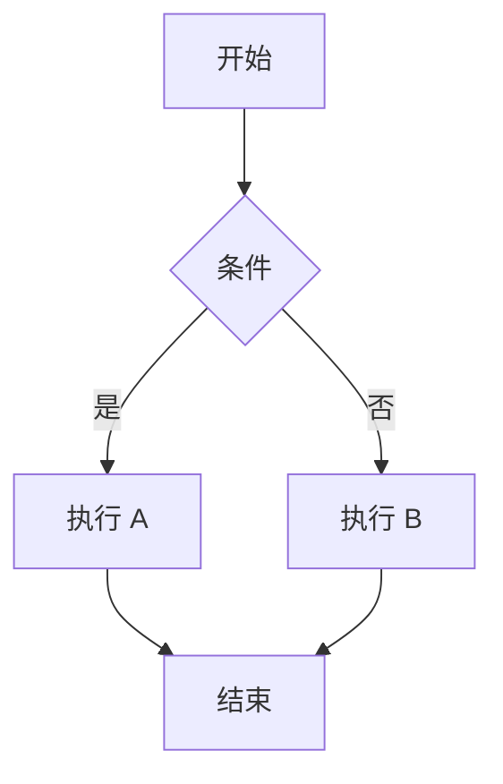
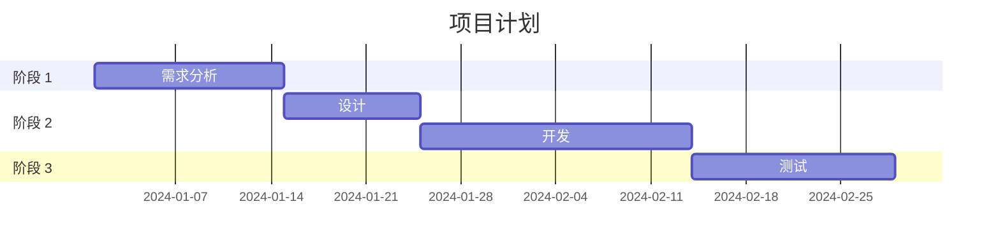
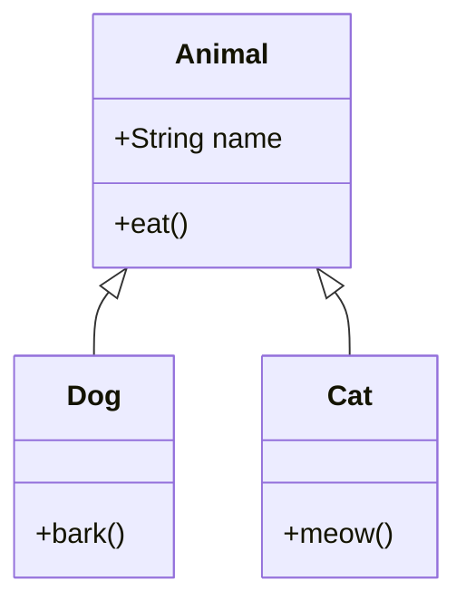

# Mermaid 图表

Docura 主题支持 Mermaid 图表语法。

## 流程图



## 序列图

```mermaid
sequenceDiagram
    participant 用户
    participant 系统
    participant 数据库

    用户->>系统：请求数据
    系统->>数据库：查询
    数据库-->>系统：返回数据
    系统-->>用户：显示结果
```

## 甘特图



## 类图


